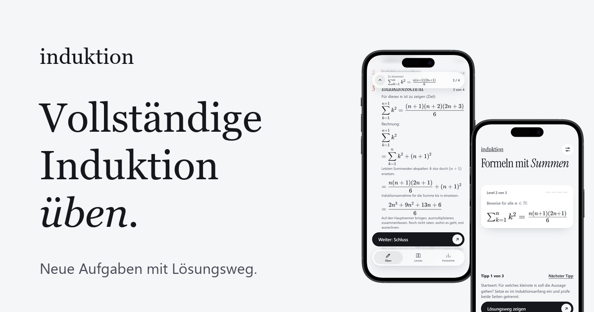
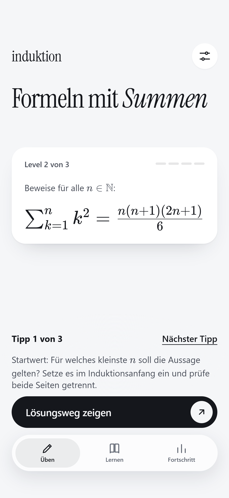
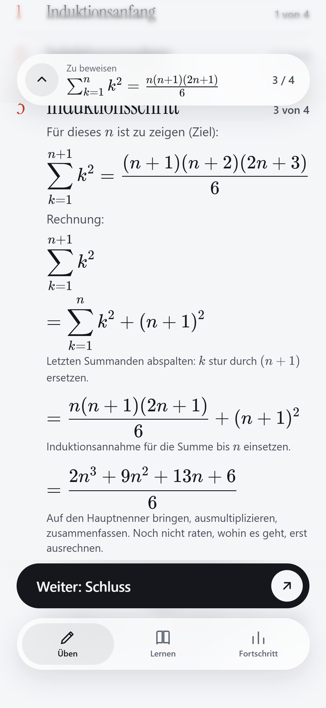
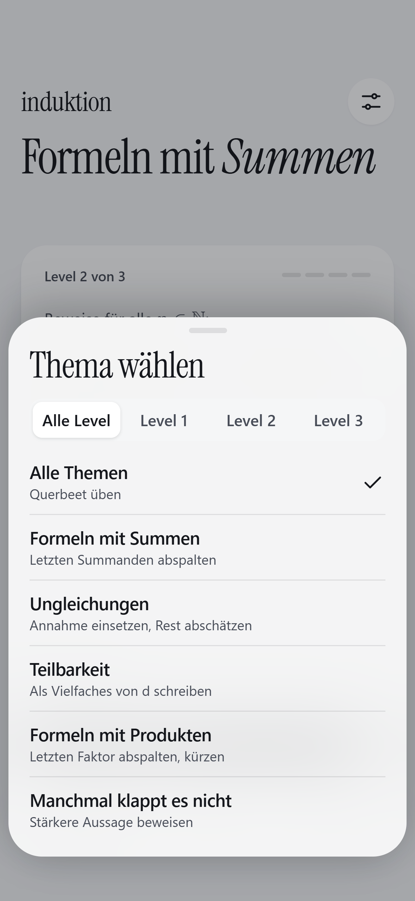
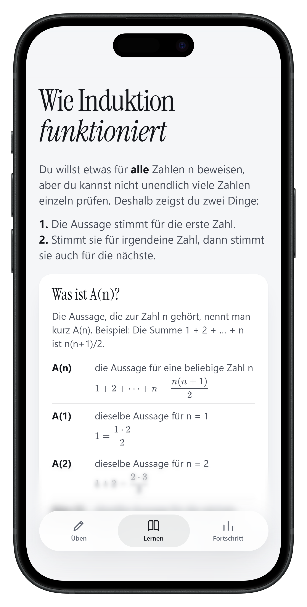
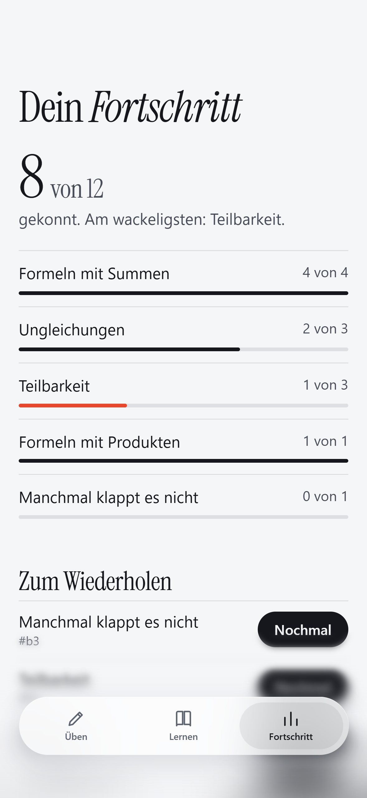
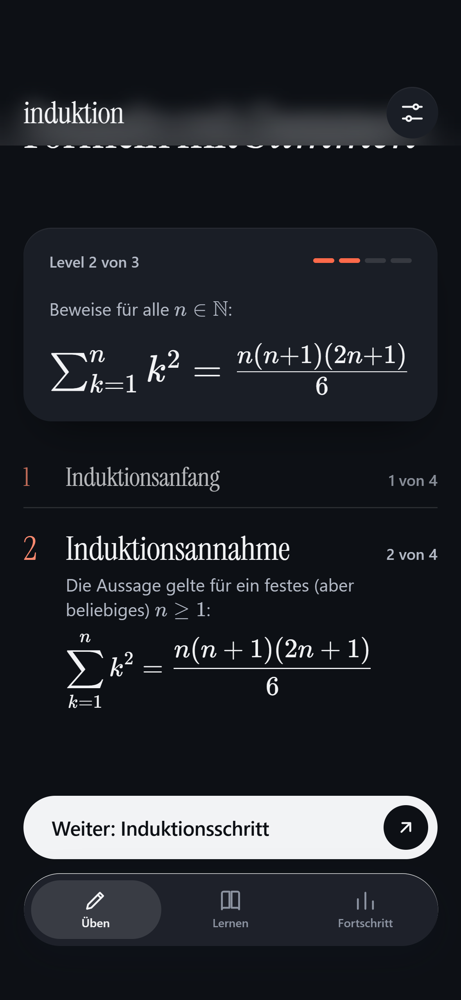

# Induktion



## Warum es das gibt

Ehrlich gesagt: Ich hasse Beweise. Vollständige Induktion fand ich lange einfach nur nervig.
Trotzdem muss ich sie können. Also wollte ich sie endlich lernen, und zwar an **vielen verschiedenen
Aufgaben**, nicht an den drei Beispielen aus dem Skript, die ich nach einer Woche auswendig kenne.

Deshalb gibt es diese App: Ich öffne sie, bekomme eine **neue Aufgabe**, löse sie auf Papier und lasse
mir danach den **Lösungsweg Schritt für Schritt** zeigen: Induktionsanfang, Annahme, Schritt, Schluss.
Nichts ist fest einprogrammiert, jede Aufgabe wird beim Öffnen frisch erzeugt. Du musst nichts eingeben, nur antippen.

## Was drin ist

Die Themen folgen der PDF „Beweise durch vollständige Induktion“ (Luise Unger, FernUniversität in Hagen):

| Thema | Beispiele |
|---|---|
| Formeln mit Summen | arithmetisch, Quadrate, Kuben, geometrisch, Teleskop, alternierend, mit Fakultät |
| Ungleichungen | `n² ≥ an+b`, `2ⁿ > an+b`, `cⁿ < n!`, Bernoulli |
| Teilbarkeit | `aⁿ − bⁿ`, `aⁿ + c`, `n³ − n`, `n(n+1)(n+2)` |
| Formeln mit Produkten | Potenzprodukte, `∏(1 + c/k)`, Teleskopprodukte |
| Manchmal klappt es nicht | stärkere Aussage beweisen, dann folgern |

- 24 Aufgabentypen in 3 Leveln. Das Thema und das Level wählst du oben rechts.
- Auf Wunsch Hinweise („Tipp anzeigen“, bis zu drei), dann der Lösungsweg Schritt für Schritt. Während du ihn liest, bleibt die Aufgabe oben angeheftet.
- Im Tab „Lernen“ ist das Prinzip erklärt (was A(n) bedeutet, die vier Teile, Dominoprinzip zum Ausprobieren).
- Fortschritt und „Nochmal üben“-Liste bleiben lokal im Browser.
- Hell, Nacht oder System. Offline nutzbar nach dem ersten Laden.

## So fühlt es sich nativ an

Systemschrift (auf dem iPhone SF Pro) und **Dynamic Type**, großer Titel, der in die Leiste einklappt,
Glas nur in der Navigation, Sheet zum Wegwischen, Aktionsblatt statt Browser-Dialog, iOS-Schalter,
sanfte Seitenwechsel und Haptik über [web-haptics](https://www.jsdelivr.com/package/npm/web-haptics).
Erneutes Antippen des aktiven Tabs springt nach oben. Auf dem iPhone: in Safari **Teilen → Zum Home-Bildschirm**,
dann läuft die App im Vollbild.

## Korrektheit

Die Lösungen werden nicht geraten. `tests/gen.test.mjs` erzeugt 3600 Aufgaben, prüft jede Behauptung
numerisch und rechnet **jede Zeile jeder Umformungskette** mit exakten Brüchen (BigInt) nach.

```bash
node tests/gen.test.mjs
```

## Starten

Kein Build nötig, nur ein statischer Server (wegen Service Worker):

```bash
python -m http.server 8000
```

Dann `http://localhost:8000` (Landingpage) oder `http://localhost:8000/app/` (die App) öffnen.

### GitHub Pages

Repository auf GitHub pushen, unter *Settings → Pages* den Branch `main` und den Ordner `/ (root)` wählen.
Alle Pfade sind relativ, die App läuft auch unter `https://<name>.github.io/<repo>/`.

## Technik

- [daisyUI 5](https://daisyui.com/docs/cdn/) über CDN (Farben und Sheet-Dialog), Tailwind Browser-Build
- [KaTeX](https://katex.org) für die Formeln
- [web-haptics](https://www.jsdelivr.com/package/npm/web-haptics) für Vibrationsfeedback
- BlurText und Blur-Text nach Vorbild von [React Bits](https://reactbits.dev), in reinem JS nachgebaut
- Eigener Code: `app/js/core.js` (Brüche, Polynome), `app/js/gen.js` (Generatoren), `app/js/app.js` (Oberfläche), `app/js/fx.js` (Effekte, Haptik)

## Lizenz

MIT, siehe [LICENSE](LICENSE). Die PDF ist nicht Teil dieses Repositories.

## So sieht es aus

| Aufgabe | Lösungsweg | Thema |
| --- | --- | --- |
|  |  |  |

| Lernen | Fortschritt | Nachtmodus |
| --- | --- | --- |
|  |  |  |
